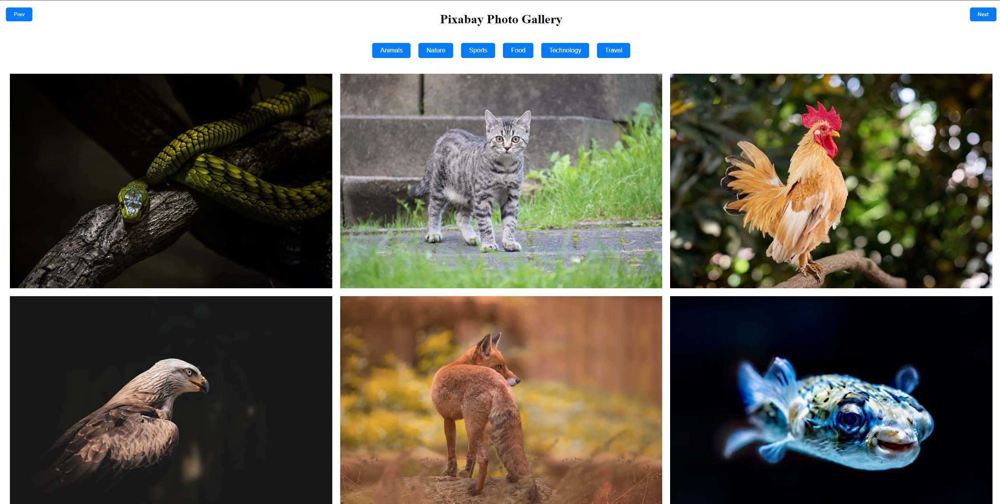

# Pixabay Photo Gallery

## Description
A full-stack application that utilizes React for the front-end and Node.js for the back-end to fetch and display images from the Pixabay API. The application features category selection, pagination, and a modal for image details.

## Features
- **Image Gallery**: Displays a grid of images fetched from the Pixabay API.
- **Category Selection**: Users can filter images by category (e.g., Animals, Nature, Sports).
- **Pagination**: Users can navigate through pages of images using "Prev" and "Next" buttons.
- **Modal View**: Clicking on an image opens a modal displaying additional information (e.g., views, downloads).

## Example Images
Here are a couple of example images from the application:


*Example of the gallery layout displaying various images.*


*Example of the modal view showing image details.*

## Installation
1. Clone the repository:
   ```bash
   git clone https://github.com/iiTzShaa/pixabay-gallery.git
